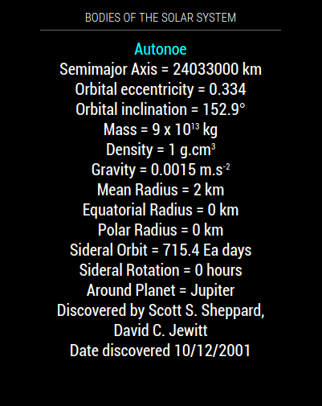

## MMM-HeavenlyBodies

* Rotation of interesting information about the bodies in our solar system.

## Example



* Individual elements can be modified and/or hidden to see just the information you want.

## Installation

* `git clone https://github.com/mykle1/MMM-ATM` into the `~/MagicMirror/modules` directory.

* No API key needed! No dependenices needed! No kidding!


## Config.js entry and options
```
{
  disabled: false,
  module: 'MMM-HeavenlyBodies',
  position: 'top center',
  config: {
    useHeader: true, // false = no header
    header: "Bodies of the Solar System",
    rotateInterval: 2 * 60 * 1000   // 2 minutes
  }
},
```

#### Thanks to https://api.le-systeme-solaire.net/en/ for the Open Data, Free API.
